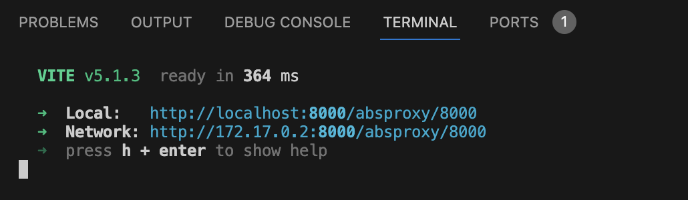

# React: Introduction to Event Handling

## Setup 
Before we begin writing code, let's setup the project and install all necesarry packages.
Open a new Terminal window and do the following steps:

1. Go to `calab` directory:
    ```
    cd calab
    ```
2. Install npm packages:
    ```
    npm install
    ```
3. Start the application:
    ```
    npm run dev
    ```
    You should see the development server being started:
    []() 

    If you open the `Local` URL in a new browser tab, you should see the follwoing:
    []()    


## Steps 

1. Create a new component called `Sport` to display color.
    -   Create new folder called `components` in `calabs/src`.
    -   Inside `components` create a new file called `Sport.jsx`
    -   `Sport.jsx` should return a `<div>` that would display a name of the Sport.
        ```
        function Sport({name}) {
            return (
                <div style={{
                    margin: '0 auto',
                    width: '200px',
                    height: '100px',
                    backgroundColor: '#123456',
                    marginTop: '10px',
                }}>
                    <h2>{name}</h2>
                    <button>Click</button>
                </div>
            )
        }
        export default Sport
        ```
2. Declare a list of sports that are played with a ball.
    -   Open `App.jsx` file and inside `App()` function declare `sports` array.
        ```
        const sports = [
            'Basketball',
            'Football',
            'Tennis',
            'Volleyball',
            'Rugby',
            'Golf',
            'Baseball'
        ];
        ```
3. Render list of sports.
    -    Inside `App.jsx` component, import `Sport` component.
    -    Then, just below the `<h1>` tag, add the following code that maps each sport from the list of sports declared previously to the `Sport` component.
        ```
        {
            sports.map( s => (
                <Sport name={s}/>
            ))
        }
        ```
4. Handle onClick Event.
    -   Go back to `Sport.jsx` component and inside `Sport()` function declare a function called `handleEvent()`, which creates an alert with name of the sport.
        ```
        const handleEvent = () => {
            alert(name);
        }
        ```
    -   Pass handleEvent reference to onClick prop of the button element.
        ```
        <button onClick={handleEvent}>Click</button>
        ```

Now go to development server and click on any of the buttons that are rendered on a screen. You should be prompted with a name of Sport the botton belong to. 
[]()  

[]()    

